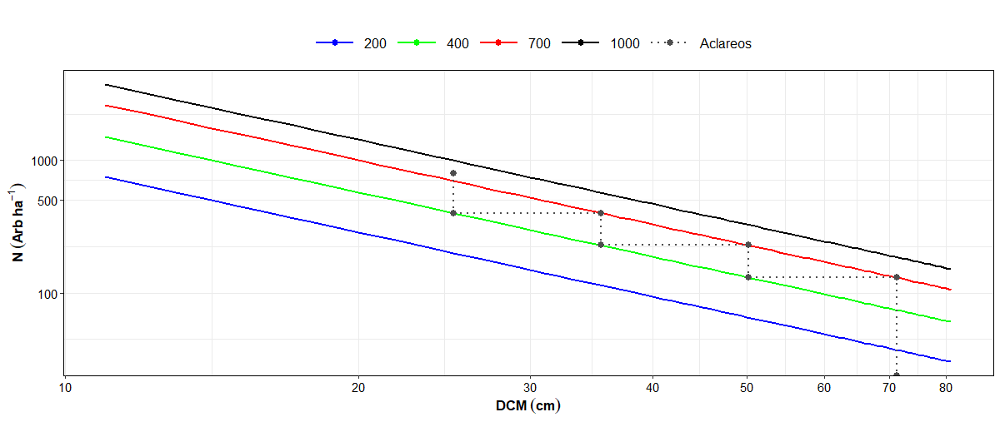

## DMD: un paquete R para realizar simulaciones de aclareos
El paquete DMD tiene la finalidad de realizar simulaciones de aclareos de forma tabular y gráfica a partir de información de densidad de un rodal.

## Instalación
Desde la consola de R:
```r
# install.packages("remotes")
library(remotes)
install_github("JosephForest99/DMD")
```

## Simulador de aclareos (tabular)
Las funciones  `sim_aclareos_reineke()` y `sim_aclareos_qr()` permiten generar simulaciones de aclareos, las cuales generan dos tipos de salidas: i) un mensaje con comentarios relacionados con la condición actual del rodal y recomendación de aclareos; y ii) una lista con la simulación en formato `data.frame` y otras siete variables de tipo numérico.

La función `sim_aclareos_reineke()` utiliza el modelo de índice de densidad de Reineke (1933) de tipo potencial, el cual tiene la forma:

$$
N = \beta_0 \times DCM^{\beta_1}
$$

Para el caso de la función `sim_aclareos_qr()` utiliza el índice de densidad propuesta por Quiñonez-Barraza y Ramírez-Maldonado (2019) de tipo exponencial y tiene la forma siguiente:

$$
N = \beta_0 \times e^{\beta_1 \times DCM}
$$

donde $$N$$ es la densidad del rodal (árboles por hectárea), $$DCM$$ es el diámetro cuadrático medio (tamaño promedio del rodal en centímetros), $$\beta_i$$ son los parámetros de regresión y $$e$$ es la exponencial.

## Descripción de las funciones de simulación de aclareos (tabular)

Para conocer los argumentos de las funciones `sim_aclareos_reineke()` y `sim_aclareos_qr()`, utilizar la función `args()`.  La utilización de ambas funciones tiene que contar con tres argumentos principales: i) `IDR_max` que corresponde al índice de densidad del rodal máximo presente en el área de interés; ii) `N` que es el número de árboles por hectáreas del rodal; y iii) `DCM` es el diámetro cuadrático medio en centímetros.

Las dos funciones tiene otros argumentos con valores por defaul, los cuales también pueden ser modificados por el usuario:
- `DCMR` es el diámetro cuadrático medio de referencia (cm) con un valor por default de 25 cm.
- `B1` que corresponde a la pendiente del respectivo modelo, el valor por default de la función `sim_aclareos_reineke()` es el recomendado por el autor del modelo de índice de densidad equivalente a -1.605 y para la función `sim_aclareos_qr()` es -0.0532.
- `No.aclareos` es la cantidad de aclareos que se pretenden realizar en la simulación. El valor por default es 3 aclareos.
- `lim_autoaclareo`, `lim_const` y `lim_libre` corresponden a los límites del desarrollo del rodal propuestos por Langsaeter como el límite del autoaclareo o mortalidad inminenten, límite de crecimiento constante y límite de crecimiento libre respectivamente. Estos tres valores son proporciones del índice de densidad del rodal máximo definido por el usuario. Los valores por default son 0.7 (`lim_autoaclareo`), 0.4 (`lim_const`) y 0.2 (`lim_libre`) y el rango para establecer los valores es de 0 a 1.

### Ejemplos de simulación de aclareos (tabular)

Cuando el rodal se encuentra por arriba del límite del autoaclareo o mortalidad inminente `sim_aclareos_reineke()`:

```r
sim_reineke <- sim_aclareos_reineke(IDR_max = 1000, N = 800, DCM = 25)
```


aplicando la función `sim_aclareos_qr()`

```r
sim_qr <- sim_aclareos_qr(IDR_max = 1000, N = 800, DCM = 25)
```


### Ejemplos simulación de aclareos (gráfica)

Con los resultados anteriores se pueden obtener las simulaciones de forma gráfica con las funciones `plot_sim_aclareos_reineke()` y `plot_sim_aclareos_qr()`. La salida genera una gráfica construida con la función `ggplot2()`.

```r
plot_sim_aclareos_reineke(sim_reineke)
```


```r
plot_sim_aclareos_reineke(sim_qr)
```


*Nota:* para utilizar la función `plot_sim_aclareos_reineke()` es necesario guardar un objeto cuando se aplica la función `sim_aclareos_reineke()`. Lo mismo se tiene que realizar cuando se utilice la función `plot_sim_aclareos_qr()`.
